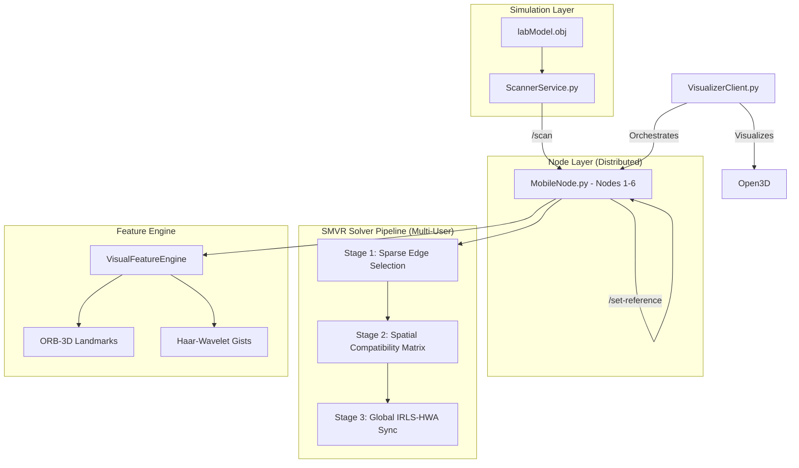

# Point Cloud Alignment Simulator

This project simulates a distributed system of mobile devices (Nodes) that perform peer-to-peer 4-DoF point cloud alignment using synthetic data generated from a 3D mesh. It implements the **Visual-Spectral Landmark Registration (VSLR-Sync)** research framework.

## System Architecture



- **Scanner Service (`ScannerService.py`)**: A central service that simulates an RGB-D camera by raycasting against `labModel.obj`. It uses a **Geometric Edge Sampling** strategy to mimic realistic mobile AR feature points.
- **Mobile Nodes (`MobileNode.py`)**: Distributedagents that request scans, store reference frames, and perform alignments.
- **SMVR Solver (`MultiUserAlignment.py`)**: A 3-stage spectral pipeline that solves for global consensus poses using algebraic connectivity and spatial consistency.
- **Wavelet Utilities (`wavelet_utils.py`)**: Experimental Haar-Wavelet descriptor compression for low-bandwidth AR synchronization.

## Setup

### Prerequisites
- Docker and Docker Compose
- Python 3.10+ (for local testing)

### 1. Start the Environment
The simulation environment must be running in Docker for the network nodes to communicate.

```bash
docker-compose up -d --build
```
This starts:
- `scanner` at `http://localhost:8000`
- `node1-node6` at `http://localhost:8001-8006`

## Running Benchmarks & Tests

### 1. Mathematical Validation (SMVR)
Verify the core spectral and synchronization logic using noise-injected synthetic data.
```bash
python3 validate_smvr.py
```

### 2. Full System Networked Benchmark
Orchestrates a 6-node scan and global alignment using the live Docker services.
```bash
python3 benchmark_visual_spectral.py
```

### 3. Visual Feature (ORB-3D) Test
Verifies the landmark extraction and back-projection from the scanner.
```bash
python3 test_visual_features.py
```

### 4. Stress Testing & Scaling
Run rigorous multi-trial scaling studies (N=60+) using the tools in the `results/` directory.
```bash
python3 results/benchmark_salience.py
```

## Key Files
- `solvers/global_solvers/MultiUserAlignment.py`: The 3-Stage Spectral Sync implementation.
- `common/visual_features.py`: The landmark extraction engine.
- `common/wavelet_utils.py`: Haar-Wavelet transform and Gist generation.
- `environment/ScannerService.py`: The raycasting-based virtual sensor.
- `VisualizerClient.py`: Orchestrates simulations and visualizes global map consistency.

## Mathematical Conventions
- **Coordinate System**: Z-Up, Right-Handed (Robotics REP-103).
- **Degrees of Freedom**: 4-DoF (Yaw + 3D Translation).
- **Scale**: Metric (1.0).
